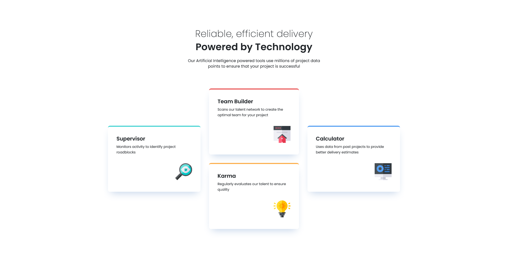
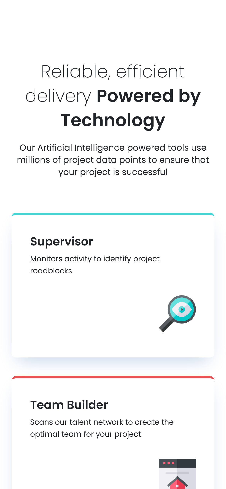

## Project Overview

This project focuses on building a responsive four-card feature section based on a design provided by Frontend Mentor. It demonstrates modern CSS techniques for layout and responsiveness, emphasizing semantic HTML and design precision.

- Responsive, mobile-first layout using modern CSS techniques
- Design precision based on a high-fidelity Figma prototype
- Clean, semantic HTML structure for scalability and accessibility
- [Link to Frontend Mentor Challenge](https://www.frontendmentor.io/learning-paths/building-responsive-layouts--z1qCXVqkD/steps/67324be4d54b5cb1de9ff9a8/challenge/start)

## Technologies Used

- HTML5
- CSS3 (Flexbox, Media Queries)
- Bootstrap (Grid System, Flexbox utilities) [Bootstrap Documentation](https://getbootstrap.com/docs/5.3/getting-started/introduction/)
- SASS (Variables, Mixins, Nesting, Modules) [SASS Documentation](https://sass-lang.com/documentation)

## Screenshots

| Desktop                                | Mobile                               |
| -------------------------------------- | ------------------------------------ |
|  |  |

## Folder Structure

project-root/
├── index.html
├── main.css        # Compiled CSS
├── src/            # SCSS source files
│   └── styles/     # SCSS partials and main file
├── assets/         # Project assets
│   ├── images/     # Project images
│   └── screenshots/ # Desktop and mobile screenshots
├── README.md

## Getting Started

1. Clone the repository: `git clone https://github.com/yourusername/project-name.git`
2. Navigate to the project directory: `cd project-name`
3. If you use SASS, compile the SCSS files: `sass src/styles/main.scss style.css`
4. Open `index.html` in your browser.

## Improvements for the Future

- Refactor card components into reusable partials for better maintainability.
- Add smooth mobile-first animation transitions using CSS transitions or animations.
- Expand JavaScript logic for interactive features, such as card flipping or expanding on click.
